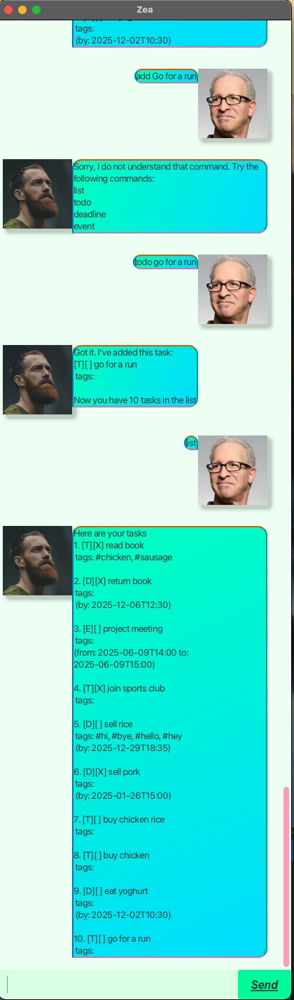

# Zea User Guide


- Zea is a chatbot that helps users keep track of tasks such as todos, deadlines and events

## List Tasks
- Lists all existing tasks
- Command: `list`
```
Here are your tasks
1. [T][X] read book
tags: #fiction
```

## Add Todos
- Add a todo to the list of tasks
- Command: `todo <DESCRIPTION>`
- Example: `todo buy shoes`
```aiignore
Got it. I've added this task: 
[T][] buy shoes
tags: 

Now you have 2 tasks in the list
```

## Add Deadlines
- Add a deadline to the list of tasks
- Command: `deadline <DESCRIPTION> /by <DATE>`
- Example: `deadline finish homework /by 05/12/2030 23:55`

```aiignore
Great! I've created a new deadline for you!
[D][] finish homework
tags:
(by: 2030-12-05T23:55)

You now have 3 tasks
```

## Add Events
- Add an event to the list of tasks
- Command: `event <DESCRIPTION> /from <DATE> /to <DATE>`
- Example: `event wedding /from 03/05/2025 12:00 /to 03/05/2025 15:00`
```aiignore
Great! I've created a new event for you!
[E][] wedding
tags:
(from: 2025-05-03T12:00 to: 2025-05-03T15:00)

You now have 4 tasks
```

## Tag Tasks
- Add tag(s) to a task
- Command: `tag <IDX> <TAG>*`
- Example: `tag 2 nike adidas jordans`
```aiignore
[T][] buy shoes
tags:#nike,#adidas,#jordans
```

## Find a Task
- Find a task whose description contains a specified keyword
- Command: `find <KEYWORD>`
- Example: `find home`
```aiignore
Here are the tasks that match the keyword: home
1. [D][] finish homework
tags:
(by: 2030-12-05T23:55)
```

## Mark as completed
- Mark a task as completed
- Command: `mark <IDX>`
- Example: `mark 2`
```aiignore
[T][X] buy shoes
tags:#nike,#adidas,#jordans
```

## Mark as not completed
- Mark a task as not completed
- Command: `unmark <IDX>`
- Example: `mark 2`
```aiignore
[T][] buy shoes
tags:#nike,#adidas,#jordans
```

## Delete a task
- Delete a task from the list permanently
- Command: `delete <IDX>`
- Example: `delete 2`
```aiignore
Sad to see this task go:
[T][] buy shoes
tags:#nike,#adidas,#jordans

Now you have 3 tasks in the list
```

## Exit the Chat
- Closes the chatbot
- Command: `bye`